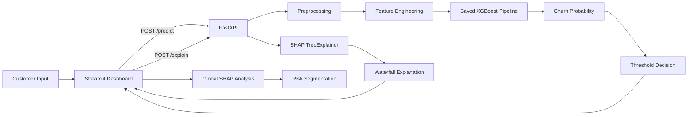

# 🧠 Customer Intelligence Platform

### AI-powered customer churn prediction, risk prioritization, and explainable retention insights.

[](https://www.python.org/)
[](https://xgboost.readthedocs.io/)
[](https://fastapi.tiangolo.com/)
[](https://streamlit.io/)
[](https://shap.readthedocs.io/)
[](https://www.docker.com/)
[](https://mlflow.org/)

> **Don't just predict who will churn — identify who is at risk, understand why, and prioritize retention action.**

---

## 🚀 Project Overview

Customer churn is not simply a classification problem. From a business perspective, the valuable question is:

> **Which customers are likely to leave, how risky are they, and what signals are driving that prediction?**

The **Customer Intelligence Platform** is an end-to-end machine learning application designed to address that problem.

The platform combines:

- 📊 Exploratory Data Analysis
- 🧹 Data preprocessing
- 🧠 Domain-driven feature engineering
- 🤖 XGBoost binary classification
- 🎯 Probability-threshold optimization
- ⚖️ Imbalance handling with `scale_pos_weight`
- 🔍 SHAP-based model explainability
- 👥 Rule-based customer risk segmentation
- ⚡ FastAPI inference services
- 🖥️ Streamlit interactive dashboard
- 📈 MLflow experiment/model logging
- 🐳 Dockerized API and dashboard architecture

The project uses the **Telco Customer Churn dataset** containing **7,043 customer records and 20 predictive/input variables plus the target**.

---

# 🎯 Business Problem

Customer acquisition is generally more expensive than retaining an existing customer.

A churn prediction system can help a telecom business:

1. Identify customers with elevated churn probability.
2. Prioritize customers for retention campaigns.
3. Understand the factors contributing to churn risk.
4. Support data-driven customer engagement decisions.

Instead of returning only:

```text
Churn = Yes
```

the platform produces:

```text
Prediction       → Will Churn
Churn Probability → 0.87
Decision Threshold → 0.72
Risk Level       → HIGH
```

and provides an explainability layer showing **which features contributed to the individual prediction**.

---

# ✨ Key Features

## 🤖 Churn Prediction

The platform uses an **XGBoost Classifier** to estimate the probability that a customer will churn.

The prediction is based on a configurable probability threshold rather than blindly using the default `0.50`.

```text
P(churn) >= threshold
        ↓
    Will Churn
```

This is particularly relevant for churn problems because the business cost of missing a potential churner can be different from the cost of contacting a customer who ultimately stays.

---

## 🎯 Threshold Optimization

The project does not treat `0.50` as a universally optimal classification threshold.

During experimentation, thresholds were evaluated across a range of values while enforcing a minimum precision requirement.

The notebook reports a selected threshold around the **0.76** region for the reduced engineered dataset.

> **Important:** the current application configuration contains `BEST_THRESHOLD = 0.72`. This difference is documented as a known reproducibility issue in the audit section below and should be reconciled before presenting final production metrics.

---

## 🧠 Feature Engineering

The project goes beyond simply feeding raw columns into XGBoost.

Custom features include:

### Family Type

Customer relationships and dependents are transformed into a higher-level family category:

```text
Partner + Dependents
        ↓
Family Type
        ↓
Alone / Has spouse / Has family
```

### Security Score

A composite score is created from:

- Online Security
- Online Backup
- Device Protection
- Tech Support

```text
SecurityScore = number of subscribed security/support services
```

### Entertainment Score

Based on:

- Streaming TV
- Streaming Movies

### Customer Tenure Type

Customers are categorized as:

```text
New
Moderate
Old
```

based on tenure.

### Rule-Based Risk Type

The project also creates a domain-inspired risk category using combinations of:

- Contract
- Payment method
- Internet service
- Tech support
- Senior citizen status

This produces:

```text
High risk
Medium risk
Low risk
```

These engineered variables allow the model and dashboard to operate at a more business-oriented level than the raw dataset alone.

---

# 🔍 Explainable AI

A major strength of the project is that it does not stop at prediction.

The application uses **SHAP (SHapley Additive exPlanations)** to provide two levels of interpretability.

### 🌎 Global Explanation

A SHAP beeswarm plot identifies the features that have the greatest overall influence on model predictions.

### 👤 Local Explanation

For an individual customer, a SHAP waterfall plot explains how the customer's feature values pushed the prediction toward or away from churn.

Conceptually:

```text
Customer
   ↓
Preprocessing
   ↓
XGBoost
   ↓
Prediction Probability
   ↓
SHAP
   ↓
Why did the model make this prediction?
```

This makes the project substantially more useful for demonstrating practical Data Science skills than a prediction-only application.

---

# 👥 Customer Risk Segmentation

The dashboard provides customer segmentation based on the engineered `RiskType` variable.

The platform calculates:

- Customer count by risk group
- Observed churn rate by risk group

This creates a bridge between:

```text
Machine Learning
       +
Business Interpretation
       ↓
Retention Prioritization
```

---

# 📊 Model Performance

The included `model_training.ipynb` compares multiple feature representations.

### Reported test-set results

| Dataset / Feature Set | Accuracy | Precision | Recall | F1 | ROC-AUC |
|---|---:|---:|---:|---:|---:|
| Original features | 74.13% | 50.84% | 80.75% | 62.40% | 83.12% |
| Engineered features | **74.77%** | **51.64%** | 80.21% | **62.83%** | **83.21%** |
| Reduced engineered features | 73.17% | 49.65% | 76.74% | 60.29% | 81.83% |

### Key observation

The engineered representation produced the strongest reported ROC-AUC and F1 score among the three evaluated versions:

- **ROC-AUC: 83.21%**
- **F1: 62.83%**
- **Accuracy: 74.77%**
- **Precision: 51.64%**
- **Recall: 80.21%**

For a churn problem, the relatively high recall is particularly relevant when the objective is to identify a large proportion of customers who may leave.

> **Metric reproducibility note:** the notebook experiments and the current `src/config.py` do not contain exactly the same optimized hyperparameters/threshold. The metrics above should therefore be treated as the results recorded by the notebook rather than automatically assumed to be the exact performance of the currently serialized `models/model.pkl`.

---

# ⚙️ Hyperparameter Optimization

The project uses **Optuna** to search over XGBoost hyperparameters.

The search space includes:

- `n_estimators`
- `learning_rate`
- `max_depth`
- `min_child_weight`
- `gamma`
- `subsample`
- `colsample_bytree`
- `reg_alpha`
- `reg_lambda`
- `scale_pos_weight`

The experimentation also compares different feature representations.

The notebook contains **150 Optuna trials** for the relevant XGBoost optimization experiments.

---

# ⚖️ Class Imbalance

The dataset is imbalanced:

```text
No Churn  ≈ 73.46%
Churn     ≈ 26.54%
```

Instead of relying exclusively on accuracy, the project evaluates:

- Precision
- Recall
- F1
- ROC-AUC

The XGBoost configuration also uses `scale_pos_weight` to increase attention to the minority churn class.

This is an important design choice because a model can achieve deceptively strong accuracy while performing poorly at identifying churners.

---

# 🏗️ System Architecture



---

# 🔄 End-to-End ML Workflow

```text
Raw Customer Data
       ↓
Data Cleaning
       ↓
Exploratory Data Analysis
       ↓
Feature Engineering
       ↓
Train / Test Split
       ↓
Preprocessing Pipeline
       ↓
Optuna Hyperparameter Optimization
       ↓
XGBoost Classifier
       ↓
Probability Prediction
       ↓
Threshold Optimization
       ↓
Model Evaluation
       ↓
Model Serialization
       ↓
FastAPI
       ↓
Streamlit Dashboard
       ↓
SHAP Explainability
```

---

# 📁 Project Structure

```text
Customer_Intelligence_Platform/
│
├── api/
│   └── main.py
│
├── dashboard/
│   └── app.py
│
├── data/
│   └── Dataset.csv
│
├── models/
│   └── model.pkl
│
├── notebooks/
│   ├── eda.ipynb
│   ├── feature_engineering.ipynb
│   └── model_training.ipynb
│
├── src/
│   ├── config.py
│   ├── data_preprocessing.py
│   ├── evaluate.py
│   ├── explain.py
│   ├── feature_engineering.py
│   ├── mlflow_utils.py
│   ├── predict.py
│   ├── train.py
│   └── utils.py
│
├── .dockerignore
├── .gitignore
├── Dockerfile
├── Dockerfile.streamlit
└── requirements.txt
```

---

# 🛠️ Technology Stack

| Category | Technologies |
|---|---|
| Programming | Python |
| Data Manipulation | Pandas, NumPy |
| Visualization | Matplotlib, Seaborn |
| Machine Learning | Scikit-learn, XGBoost |
| Optimization | Optuna |
| Explainability | SHAP |
| API | FastAPI, Pydantic |
| Dashboard | Streamlit |
| MLOps | MLflow |
| Serialization | Pickle |
| Deployment | Docker |
| Hosting Target | Render |

---

# 🚀 Installation

## 1. Clone the repository

```bash
git clone https://github.com/Prasoon-Kumar107/Customer_Intelligence_Platform.git
cd Customer_Intelligence_Platform
```

## 2. Create a virtual environment

### Windows

```bash
python -m venv .venv
.venv\Scripts\activate
```

### Linux / macOS

```bash
python3 -m venv .venv
source .venv/bin/activate
```

## 3. Install dependencies

```bash
pip install -r requirements.txt
```

---

# ▶️ Running the Application

The platform is designed as two services:

```text
Streamlit Dashboard
        ↓
FastAPI Backend
```

## Start FastAPI

From the project root:

```bash
uvicorn api.main:app --host 0.0.0.0 --port 8000
```

API documentation:

```text
http://127.0.0.1:8000/docs
```

## Start Streamlit

Open another terminal:

```bash
streamlit run dashboard/app.py
```

The Streamlit application will normally be available at:

```text
http://localhost:8501
```

---

# 🔌 API Endpoints

## `GET /`

Basic API health/message endpoint.

## `GET /health`

Returns:

```json
{
  "status": "Ok"
}
```

## `POST /predict`

Accepts customer information and returns:

```json
{
  "prediction": "Will Churn",
  "churn_probability": 0.87,
  "threshold": 0.72
}
```

## `POST /explain`

Accepts customer information and returns a SHAP waterfall plot as a PNG image.

---

# 🐳 Docker

The repository contains separate Dockerfiles for the API and Streamlit dashboard.

### FastAPI

```bash
docker build -f Dockerfile -t customer-intelligence-api .
docker run -p 8000:8000 customer-intelligence-api
```

### Streamlit

```bash
docker build -f Dockerfile.streamlit -t customer-intelligence-dashboard .
docker run -p 8501:8501 customer-intelligence-dashboard
```

For a cloud deployment, the Streamlit service should communicate with the deployed FastAPI service through the `API_URL` and `EXPLAIN_API_URL` environment variables.

---

# 📈 MLOps with MLflow

The training code integrates MLflow for:

- Experiment tracking
- Parameter logging
- Metric logging
- Model logging
- Run tagging

The training experiment is named:

```text
Customer Churn Model
```

and the run is tagged with information such as:

```text
model_type = XGBoost
optimization = Optuna
task = Binary Classification
```

---

# 🧪 Example Use Case

Imagine a customer with:

```text
Contract          → Month-to-month
Internet Service  → Fiber optic
Tech Support      → No
Payment Method    → Electronic check
Tenure            → Low
Monthly Charges   → High
```

The system can produce:

```text
Prediction
    ↓
Will Churn

Probability
    ↓
87%

Risk
    ↓
HIGH

Explanation
    ↓
SHAP identifies the strongest contributing features
```

A retention team can then prioritize this customer for intervention.

---

# 💡 Why This Project Matters

This project demonstrates more than the ability to train a classifier.

It combines several skills expected from a practical Data Scientist:

### 📊 Analytical Thinking

EDA and feature-level analysis are used to understand customer behavior.

### 🧠 Feature Engineering

Raw customer attributes are transformed into business-oriented signals.

### 🤖 Machine Learning

XGBoost is optimized using Optuna and evaluated using multiple classification metrics.

### 🎯 Decision Optimization

The classification threshold is tuned instead of assuming that `0.50` is always optimal.

### 🔍 Explainability

SHAP is used to answer:

> **Why did the model predict that this customer will churn?**

### 🚀 Deployment

The trained model is exposed through FastAPI and consumed by a Streamlit dashboard.

### ⚙️ MLOps

MLflow is integrated into the training workflow for experiment and model logging.

---

# ⚠️ Current Limitations & Planned Improvements

The project is strong as a portfolio application, but several improvements would make it substantially more production-ready.

## 1. Move Feature Engineering Inside the Pipeline

The current architecture performs:

```text
Raw Data
   ↓
data_preprocess()
   ↓
feature_engineering()
   ↓
Pipeline
```

A stronger production architecture would be:

```text
Raw Data
   ↓
Pipeline
   ├── preprocessing
   ├── feature engineering
   └── model
```

This would reduce the risk of training/inference transformations becoming inconsistent.

---

## 2. Reconcile the Model Configuration

The notebook's final optimized parameters and the values stored in `src/config.py` are not identical.

The notebook's final recorded Optuna result is approximately:

```text
n_estimators      = 146
learning_rate     ≈ 0.01169
max_depth         = 3
min_child_weight  = 9
gamma             ≈ 4.681
subsample         ≈ 0.934
colsample_bytree  ≈ 0.807
scale_pos_weight  ≈ 9.998
```

while `src/config.py` contains a different parameter set.

This should be made reproducible by saving the winning experiment configuration as the single source of truth.

---

## 3. Reconcile the Decision Threshold

The notebook records a threshold around:

```text
0.76
```

while the application configuration uses:

```text
0.72
```

The final deployed model, threshold, and reported metrics should always correspond to the same experiment/version.

---

## 4. Add Automated Tests

The repository currently does not contain a dedicated test suite.

Recommended additions:

```text
tests/
├── test_preprocessing.py
├── test_feature_engineering.py
├── test_prediction.py
├── test_api.py
└── test_explainability.py
```

---

## 5. Add CI/CD

A GitHub Actions workflow could automatically:

```text
Push
 ↓
Install dependencies
 ↓
Run tests
 ↓
Lint
 ↓
Build Docker image
 ↓
Deploy
```

---

## 6. Improve Model Artifact Versioning

The serialized `model.pkl` is environment/version sensitive.

A stronger production implementation would explicitly track:

- Python version
- scikit-learn version
- XGBoost version
- preprocessing schema
- model version
- training dataset version
- threshold
- experiment/run ID

MLflow can serve as the central registry for this metadata.

---

## 7. Improve API Error Handling

The prediction endpoint currently returns a generic:

```text
Prediction failed.
```

for internal exceptions.

A production API should log the underlying exception server-side while returning a safe, structured error response to the client.

---

## 8. Validate Zero-Charge Customers

The dashboard permits `TotalCharges = 0`, while the API schema currently requires:

```text
TotalCharges > 0
```

The source dataset contains customers with zero/blank total charges associated with zero tenure.

The validation rule should therefore be aligned with the actual business/data domain.

---

# 🧭 Future Roadmap

Potential next steps:

- [ ] Move feature engineering into the sklearn pipeline
- [ ] Centralize model configuration
- [ ] Version threshold + model + dataset together
- [ ] Add automated tests
- [ ] Add GitHub Actions CI/CD
- [ ] Add model drift monitoring
- [ ] Add prediction logging
- [ ] Add calibration analysis
- [ ] Add Precision-Recall and ROC curves to the dashboard
- [ ] Add confusion matrix visualization
- [ ] Add retention campaign simulation
- [ ] Add customer-level recommended retention actions
- [ ] Add MLflow Model Registry
- [ ] Add Docker Compose for local multi-service orchestration

---

# 🎓 What I Learned

Through this project, I worked across the complete Data Science lifecycle:

```text
Problem Definition
      ↓
Data Understanding
      ↓
EDA
      ↓
Feature Engineering
      ↓
Model Development
      ↓
Hyperparameter Optimization
      ↓
Threshold Optimization
      ↓
Model Evaluation
      ↓
Explainable AI
      ↓
API Development
      ↓
Interactive Dashboard
      ↓
Containerization
      ↓
Deployment
```

The project helped bridge the gap between **building a machine learning model** and **building a usable machine learning application**.

---

# 👨‍💻 Author

**Prasoon Kumar**

B.Tech Computer Science Student
Aspiring Data Scientist

### Areas of Interest

- Data Science
- Machine Learning
- Explainable AI
- NLP
- MLOps
- Applied Machine Learning

---

# ⭐ If You Found This Project Interesting

If this project demonstrates the kind of practical Data Science work you value, consider giving the repository a ⭐.

Feedback, suggestions, and improvements are welcome.

---

## 📌 Project Positioning

> **An end-to-end, explainable customer churn intelligence system that combines predictive modeling, business-oriented risk segmentation, API deployment, interactive visualization, and MLOps practices.**
